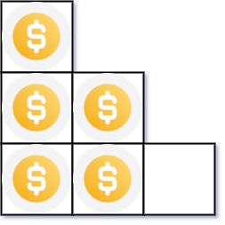
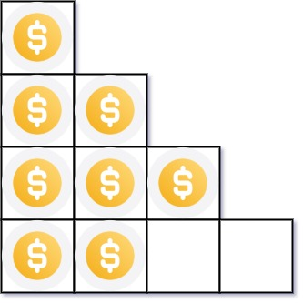

# [441. Arranging Coins](https://leetcode.com/problems/arranging-coins)

You have `n` coins and you want to build a staircase with these coins. The
staircase consists of `k` rows where the `i$^th$` row has exactly `i` coins. The
last row of the staircase **may be** incomplete.

Given the integer `n`, return _the number of **complete rows** of the staircase
you will build_.

**Example 1:**

> **Input:**
>
> - `n = 5`
>
> **Output:** 2
>
> **Explanation:** Because the 3$_rd$ row is incomplete, we return 2.

**Example 2:**

> **Input:**
>
> - `n = 8`
>
> **Output:** 3
>
> **Explanation:** Because the 4$^th$ row is incomplete, we return 3.

**Constraints:**

- `1 <= n <= 2$^31$ - 1`
