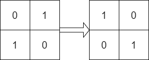
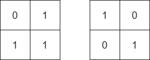
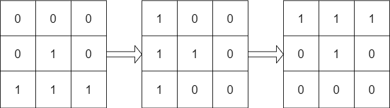

# [1886. Determine Whether Matrix Can Be Obtained By Rotation](https://leetcode.com/problems/determine-whether-matrix-can-be-obtained-by-rotation)

Given two `n x n` binary matrices `mat` and `target`, return `true` _if it is
possible to make `mat` equal `target` by **rotating** `mat` in **90-degree
increasements**, or `false` otherwise_.

**Example 1:**

> **Input:**
>
> - `mat = [[0, 1], [1, 0]]`
> - `target = [[1, 0], [0, 1]]`
>
> **Output:** true
>
> **Explanation:** We can rotat mat 90 degrees clockwise to make mat equal
> target.

**Example 2:**

> **Input:**
>
> - `mat = [[0, 1], [1, 1]]`
> - `target = [[1, 0], [0, 1]]`
>
> **Output:** false
>
> **Explanation:** It is impossible to make mat equa target by rotating mat.

**Example 3:**

> **Input:**
>
> - `mat = [[0, 0, 0], [0, 1, 0], [1, 1, 1]]`
> - `target = [[1, 1, 1], [0, 1, 0], [0, 0, 0]]`
>
> **Output:** true
>
> **Explanation:** We can rotate them 90 degrees clockwise two times to make mat
> equal target.

**Constraints:**

- `n == mat.length == target.length`
- `n == mat[i].length == target[j].length`
